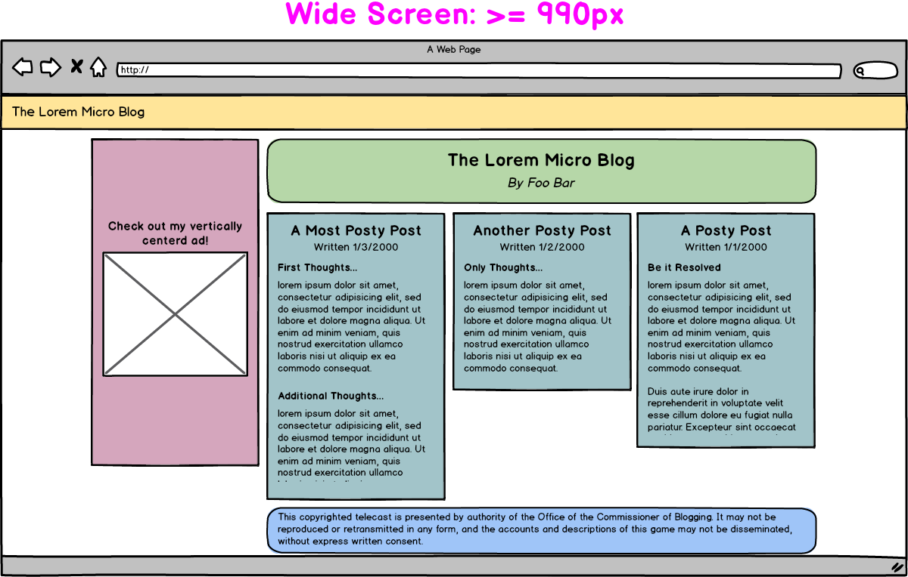

# More CSS Discussion

### Pulse: JavaScript Basics?
- Was it easy?
- Still working?

### Pulse: Optionals? Flex Box?
- Flexbox Froggy: https://flexboxfroggy.com/
- Grid Garden: https://cssgridgarden.com/

### What questions did you have trying to solve it?
- Anyone who wants to share what they discovered?

### Cover the Reading for Today...
- Building in Layers - http://learn.codingdojo.com/m/2/4654/37465
    - HTML First
    - CSS Second

### Prepare for Portfolio
- Demo: 