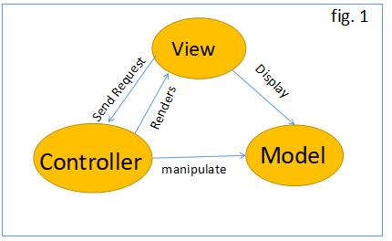

# :tada:WELCOME TO WEEK 9 DAY 4! :tada:

## Today's Agenda

---

## Nominate this week's champion in MatterMost

- Write a message in your team channel who you nominate and reason

### - Will announce tomorrow morning!

---

## :video_game:ACTIVITY DAY:space_invader: - 1pm

### :balloon:Join us here in main room for JackBox games! Nathan will host a stream so come participate as a player or watch as audience.

- go to jackbox.tv and enter the room # you see in zoom
- most games support 8 players so don't be shy!

---

## :page_with_curl:CODE REVIEW - 2:30pm || 3:00pm

### Puzzles OR Wizard Ninja Samurai

#### - _1. demonstrate functionality_

#### - _2. explain your thought process and workflow_

#### - _3. if you had problems, how did you overcome?_

#### - _4. feedback on code_

- Team 1 - Coding Pirates - 3:00pm with Monica :see_no_evil:
- Team 2 - Spoiled Coders - 2:30pm with Monica :see_no_evil:
- Team 6 - Future Developers - 3:00pm with Nathan :guardsman:
- Team 7 - CodingNinjas - 2:30pm with Alreem :dancer:
- Team 8 - The Warriors - 3:00pm with Alreem :dancer:

---

## Nathan will :memo:demo `Hungry Ninja` Assignment :eyes: @ 4PM

---

## :school_satchel: ASP.NET Core Intro - ~10am

### - Use MVC 3.1

### - ASP Service 3.1

### - Controllers

### - Routing

### - Rendering Views

### - Emmet with Razor _(setting up `!` shortcut for html code)_

### - Razor View Engine _(like Jinja for Flask/Django)_

### - Redirecting

### - IActionResult

### - Static Files

### - ViewBag _(like context dictionary in Django)_

### - Forms

### - MVC Templates 3.1

### - Generated Files

---

### END OF DAY GOAL: :sparkler: Dojo Survey :sparkler:

---
