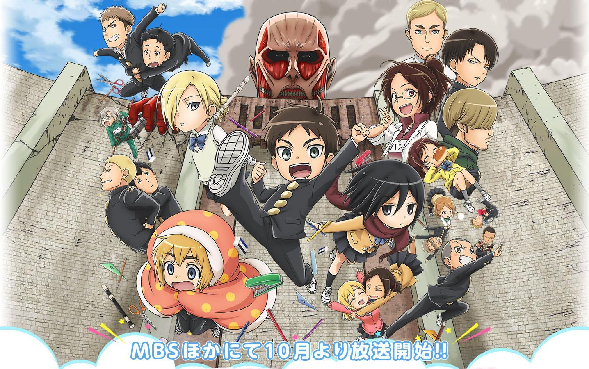
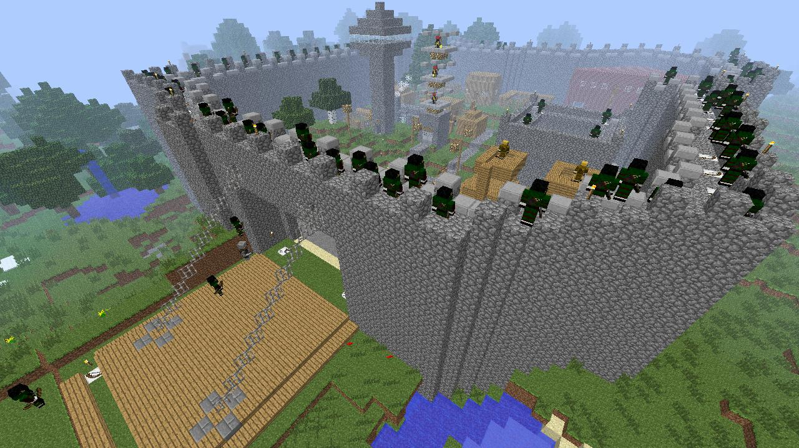
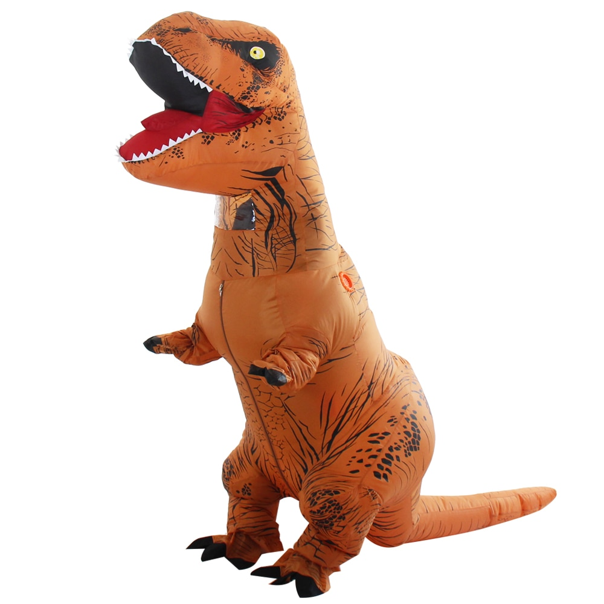
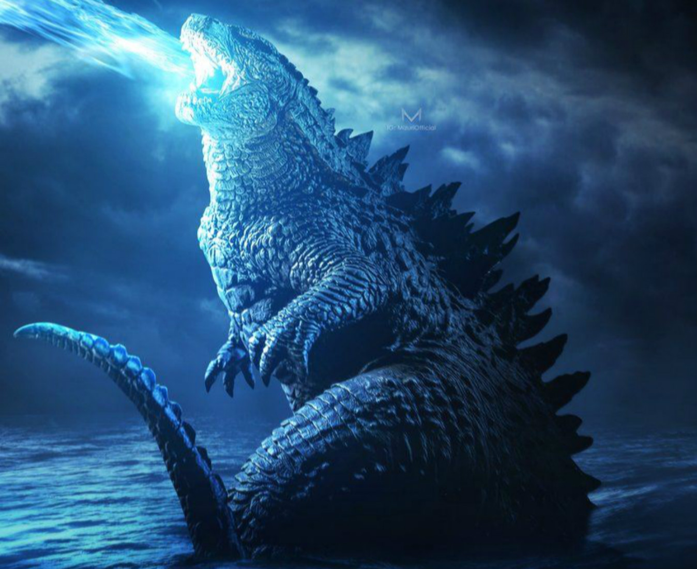

# Welcome to our Python OOP Attack-athon!

## WE ARE UNDER ATTACK!

### **Giant Dinosaurs** have appeared since over 100 years and are attacking our castle walls! They have breached the outer wall but the military has defended!

### The military is planning on dispatching Troups to :zap:**_ATTACK ON DINOSAURS_**:zap:!

#### The below are artifacts and manuals that were found with information about Dinosaurs, The Castle Walls, and the Soldier recruiting process.

#### Work in your teams to help the castle defend and attack

## Your mission (Each Team choose at least 3):

### 1. Train Humans to become Soldiers who can Fight

### 2. Group Soldiers together into a Troop with a Captain

### 3. Discover Special Ability for Soldier to turn into a Dinosaur!

### 4. Pursue and hunt at least 1 Dinosaur

### 5. Become evil and create more Dinosaurs to attack!
