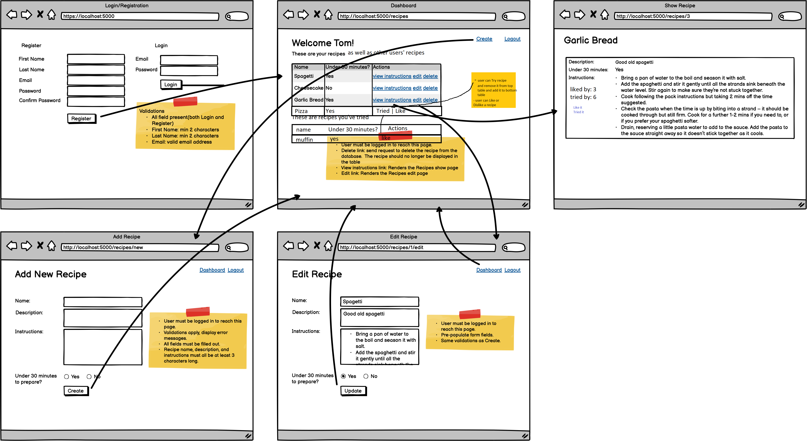

# WELCOME TO WK5 D3!

## Today we will practice building model classes

- [Events] - http://learn.codingdojo.com/m/172/8193/55816
  

- Couple changes:
    - show all recipes in the table
    - show Actions to Edit and Delete if recipe belongs to logged in user
    - Add button to Like a recipe
    - Create method to show if user has tried the recipe
    - Make a table to show all the recipes user has tried
    - on the show Recipe page, add a link to go back to /recipes

## Build Full App
