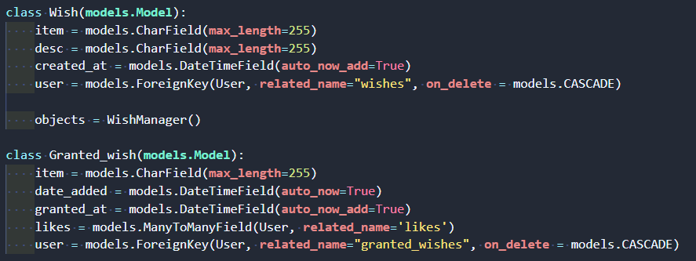

# :star2: WELCOME TO WEEK 6 :star2:

# EXAM CONCLUSION / RETAKE

## Exam Concern and Warning

- First warning:
- Found 7 exams with matching models, urls, and views
- Possible shared code or searched same public repo online
- 
- Important to complete the exam on your own

### Academic Dishonesty + Plagiarism

- You may use google or stackoverflow to find solutions to reference but do not copy and paste
- It is EASY to spot copied code
  - Looking for code that reads uniformly with the rest of the code
- Consequences will be probation and expulsion from program
### Red flags

- Different naming conventions
  - if using camel_case in variable names and suddenly change to camelCase
- if variable names and code style does not match previous turned in assignments
- if there are no changes to code copied from Instructor Repo
- if there is exact same spelling issues
- using patterns and logic style not covered in class
- unique variable namings that have meaning to a specific student

### Advice

- Reference class notes before googling for solutions
  - Most criteria on the Exam, if not all, are discussed in class demo and are in the Repo
- Ask questions to clarify if Models are hard to figure out
  - Can ask for Model check before migrating
- Remember this exam is like a checkpoint in a game. To assess how much you can do in 5 hours
    - Retaking an exam is very common - There are instructors who have taken the exams 8 times!
    - Only become better developer
    - Easier the second time around

## Retaking Exam

### Retake will be different exam

- Ask for help or work together to complete Wish app exam
- When finished, ask for check to show your exam works and you can obtain new exam code
- Complete all red belt requirements and get it checked before going onto Black Belt requirements
    - Will not pass if any of the red belt items are not completed even if you tried some black belt features

## Deploying

- Must be AWS because this is industry standard
- Can take the week to complete deploy
- Can ask for help

## Python Project Week

- Goal: Build something using Django or Flask
- Duration: May 2, 2021 - May 6, 2021
- Members: Individual or group (maximum of 5)

  - Recommend at least 1 project worked in teams
  - Ideally, projects will be useful for your professional CV and resumes

- [ ] Fill out project info in the Python tab [here](https://docs.google.com/spreadsheets/d/1MhOfh3lj8pPpIYqoeuMbsD2n305UtHmzh3nkM01bQWM/edit#gid=1668133038)
- [ ] Project Idea Approval Date: May 4, 2021
- [ ] Live Presentions May 6, 2021 @ 3pm

## Links

- [Project Guidelines](http://learn.codingdojo.com/m/119/6155/42955)
- [Django Extras](http://learn.codingdojo.com/m/119/4700/32270)
- [Project Resources](https://github.com/TheCodingDojo/student_md_docs/blob/master/py/project_resources.md)

## Week 5 Champion still needs nominations from all the teams
- please nominate a member in your team chats today to announce tomorrow